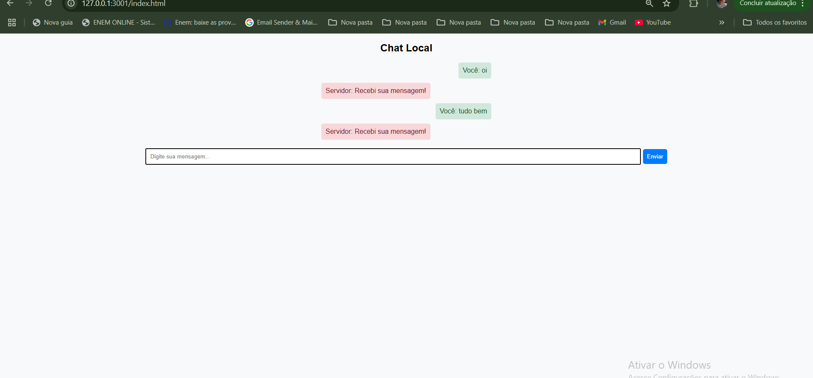
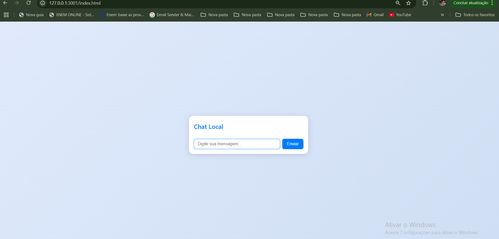
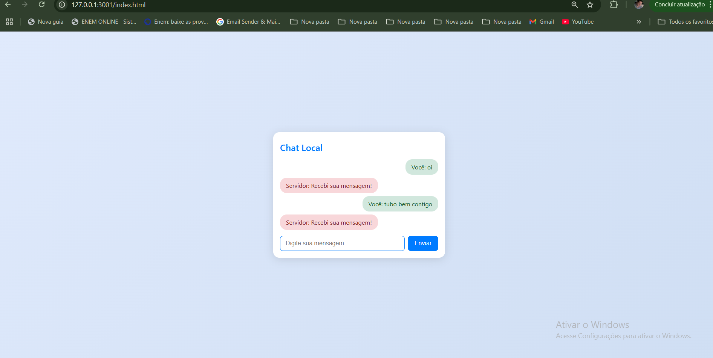

# 💬 Chat em Tempo Real

## 📝 Descrição

Este é um projeto de chat ao vivo utilizando Node.js e Socket.io. Ele permite que usuários enviem e recebam mensagens em tempo real, proporcionando uma experiência interativa.

# 🚀 Funcionalidades

 📩 Envio e recebimento de mensagens em tempo real

🔔 Notificação de entrada e saída de usuários

🎨 Interface responsiva

👥 Suporte a múltiplos usuários simultaneamente

# 🛠️ Tecnologias Utilizadas

🖥️ Front-end: HTML, CSS, JavaScript

🖧 Back-end: Node.js, Express, Socket.io

📂 Estrutura do Projeto

# 📌 Instalação

Clone este repositório:

Entre no diretório do projeto:

Instale as dependências:

Inicie o servidor:

# 🖥️ Como Usar

Acesse http://localhost:3000 no navegador.

Digite uma mensagem e envie.

Veja mensagens de outros participantes em tempo real.

🤝 Como Contribuir

🍴 Fork o repositório

🌱 Crie uma branch para sua funcionalidade (git checkout -b minha-feature)

💾 Commit suas mudanças (git commit -m 'Adicionando minha feature')

🚀 Envie para o repositório (git push origin minha-feature)

🔄 Abra um Pull Request

---

# Imagens do Chat Online com WebSocket

 

---

 

---

 

# 📜 Licença

Este projeto está licenciado sob a MIT License.

